# 📰 NewsExplorer

**NewsExplorer** is a modern React-based web application that lets users explore the latest news articles fetched from the [News API](https://newsapi.org/v2/everything). Users can log in, view trending news, and save articles they like for later reading.

🌐 **Live Demo:** https://clever-sherbet-993aa0.netlify.app

---

## ✨ Features

- 🔎 Browse trending news articles from around the world.
- ✅ Log in to save your favorite articles.
- 🔐 API keys and base URLs secured with environment variables.
- ⚡ Built with **React + Vite** for fast development and performance.
- 🌍 Deployed on **Netlify** for fast global hosting.

---

## 🔧 Tech Stack

- **React**
- **Vite**
- **Node.js**
- **Netlify**
- **News API**
- **Google Fonts**
- **CSS**

---

## 🚀 Getting Started

### 1. Clone the repository

```bash
git clone https://github.com/sensey0702/se_project_newsexplorer.git
cd se_project_newsexplorer
```

### 2. Install Dependencies

```bash
npm install
```

### 3. Set Up Environment Variables

```bash
VITE_NEWS_API_KEY=your_news_api_key
```

### 4. Start Local Development Server

```bash
npm run dev
```

---

## 🔐 Test Login

Use the following credentials to test the login functionality:

- **Email:** `test@test.com`
- **Password:** `test123`

---

## 📸 Screenshots

### 🏠 Home Page

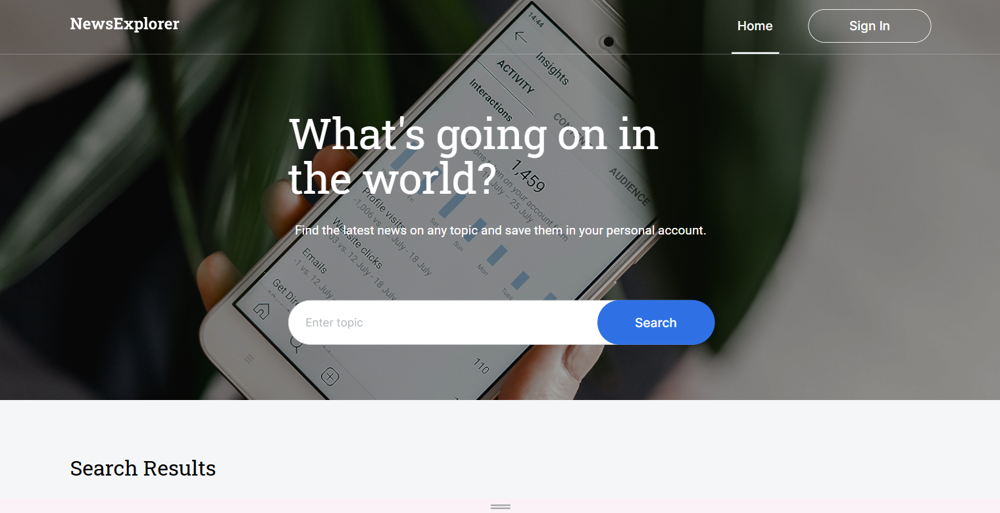

### 🔐 Login Page

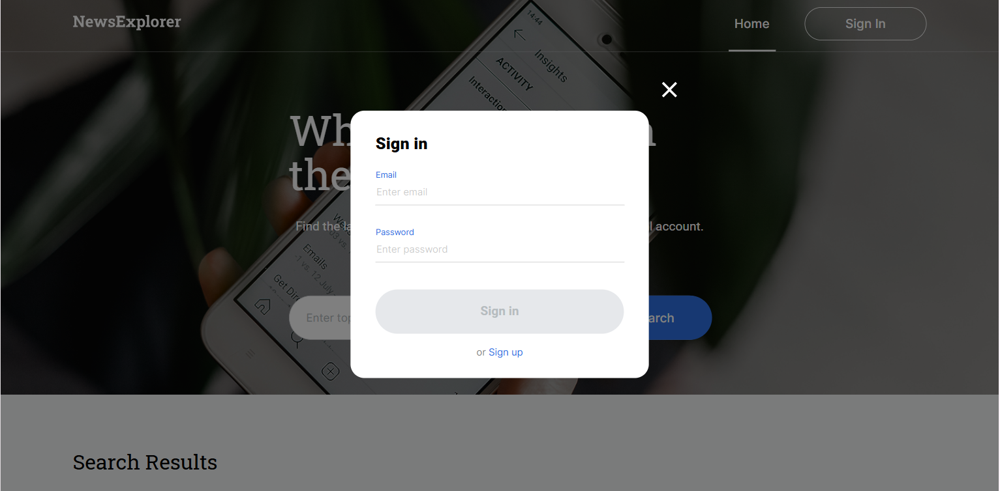

### 💾 Saved Articles

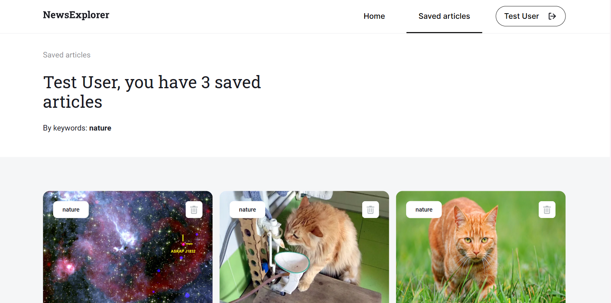

---

## Responsive Web Design!

### Mobile Views

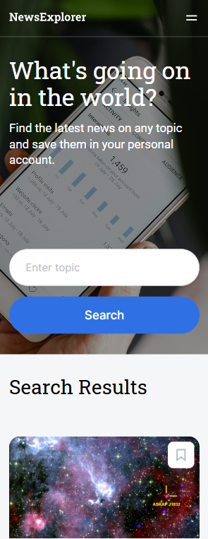
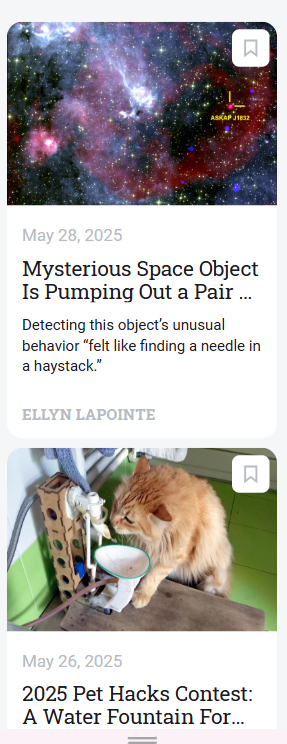
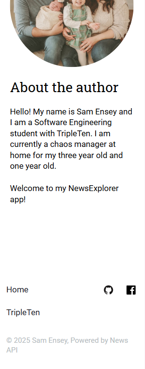

### Tablet Views

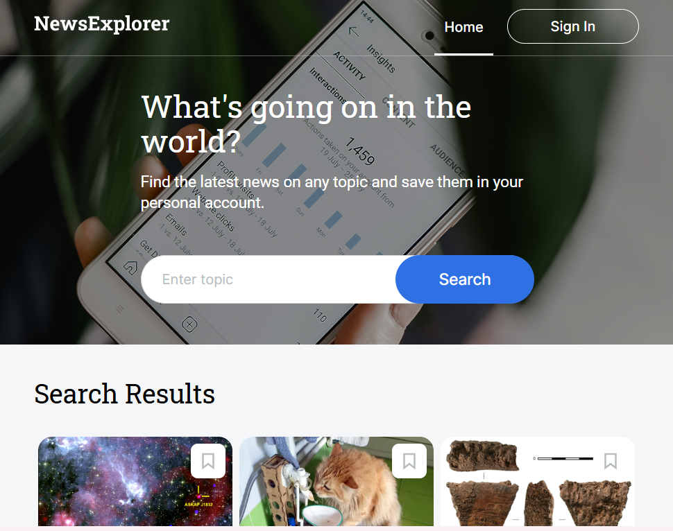
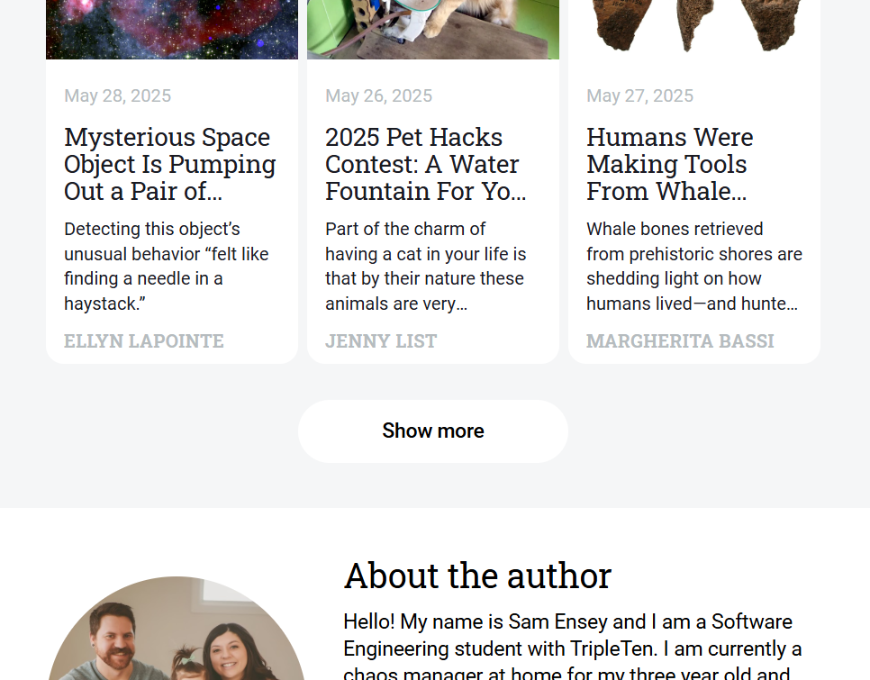
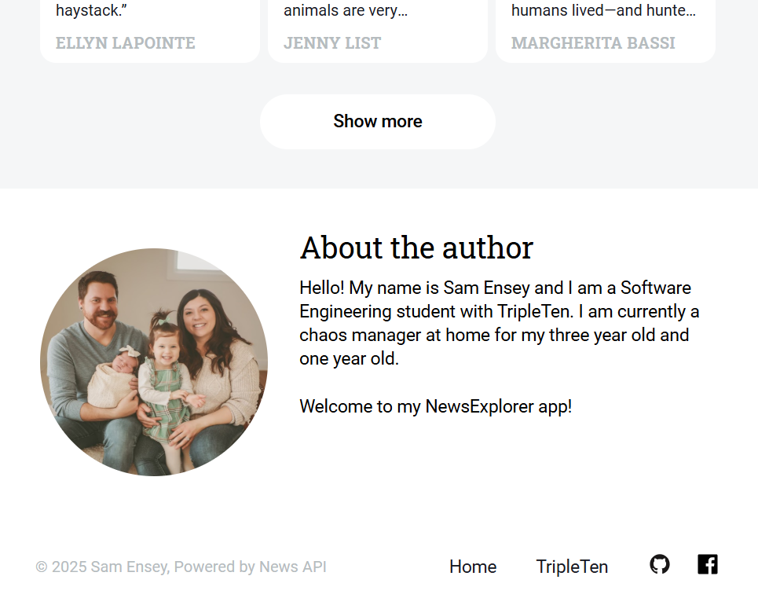

### Desktop Views


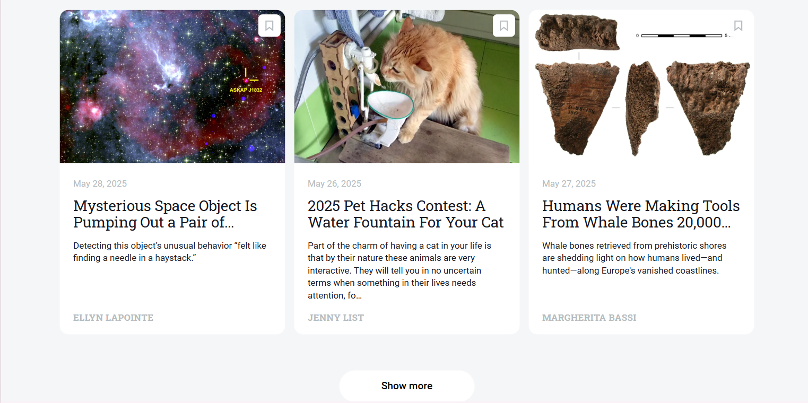
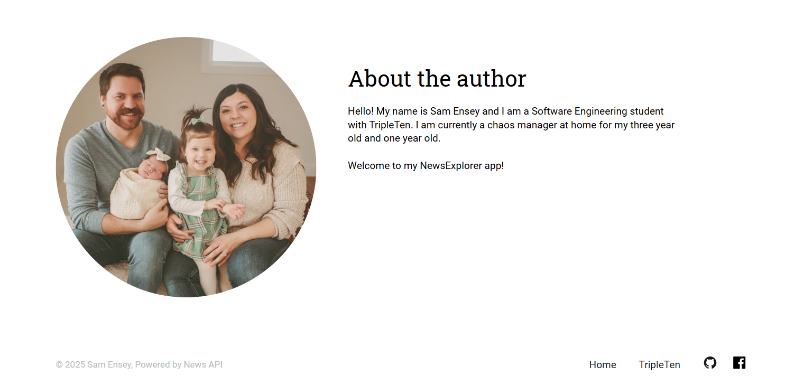

---

## 📅 Roadmap / Coming Soon

- **Backend using Express**
